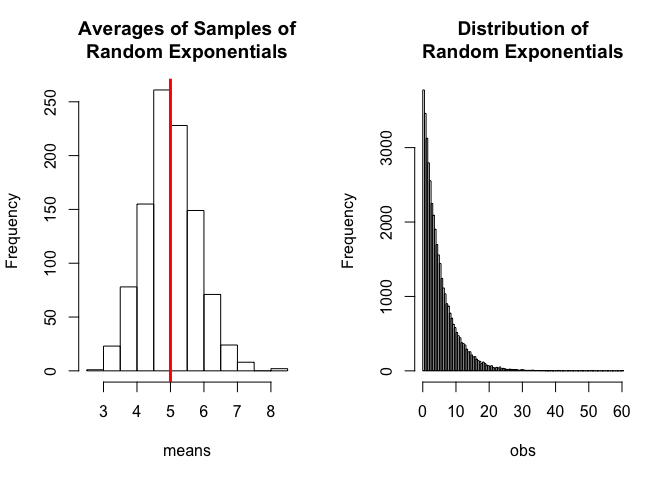

# Simulation with Exponential Distribution
Rashan Jibowu  
April 25, 2015  

## Overview

In this report, we investigate the exponential distribution and compare it with the Central Limit Theorem (CLT). Using 1,000 simulations, we compare the observed distribution of the means with the theoretical mean as prescribed by the CLT. Similarly, we compare the observed variance with the theoretical variance as prescribed by the CLT.

The code below sets up the simulation. 


```r
# set up simulation parameters
set.seed(12)
n <- 40
lambda = 0.2
nosim <- 1000
```

## Simulations

Below, we simulate the sampling for 40 random numbers from the exponential distribution 1,000 times. For each sample of 40 random exponentials, we calculate the mean and standard deviation.


```r
# generate sample of 1000 * 40 random numbers from the exponential distribution
obs <- rexp(n * nosim, rate = lambda)
simulations <- matrix(obs, nrow = nosim, ncol = n)

# calculate means for each simulation
means <- apply(simulations, 1, mean)
```

## Sample Mean versus Theoretical Mean

Show the sample mean and compare it to the theoretical mean of the distribution.

The mean of the exponential distribution is characterized is characterized by 1/lambda. Since `lambda` is `0.2` in this simulation, the theoretical mean is `1 / 0.2`, or `5`.


```r
print(paste("Theoretical mean:", 1/lambda))
```

```
## [1] "Theoretical mean: 5"
```

Since we are using simulation, we can directly observe the mean of the random samples taken from the exponential distribution. The observed mean in the sample is given by `mean(means)`.


```r
print(paste("Observed mean:", round(mean(means), 4)))
```

```
## [1] "Observed mean: 5.01"
```

Since the theoretical (CLT) mean approximates the observed mean, we can see how the CLT correctly estimates the mean of a distribution when a sufficient number of samples are taken.

## Sample Variance versus Theoretical Variance

Assuming a normal distribution of the means, the Central Limit Theorem holds that the variance of the distribution of the means is the squared standard error of the mean. Thus, the following must be true for the exponential distribution:

1. Standard deviation = `1 / lambda`. 
2. Standard error = `(1 / lambda) / sqrt(n)`.
3. Variance = `((1 / lambda) / sqrt(n)) ^ 2`.

Since lambda is assumed to be `0.2` and each sample contains 40 random exponentials -- (n = 40), we can use the CLT to calculate the theoretical values for variance:

1. Standard deviation is `1 / 0.2`, or `5`
2. Standard error is `5 / sqrt(40)`, or 0.791

Standard Deviation


```r
std.dev <- 1 / lambda
std.dev
```

```
## [1] 5
```

Standard Error


```r
std.err <- std.dev / sqrt(n)
std.err
```

```
## [1] 0.7905694
```

Variance (theoretical)


```r
var.theoretical <- (std.err)^2
var.theoretical
```

```
## [1] 0.625
```

We can also directly observe the variance in the distribution of the means. The observed variance is given by:


```r
var.observed <- round(var(means), 3)
var.observed
```

```
## [1] 0.615
```

As shown above, the CLT also helps us correctly approximate the variance of the distribution of sample means from the exponential distribution.

## Distribution of the Sample Means

The CLT also posits that the distributions of sample means is approximately normal with a mean centered around the theoretical mean. Based on the plot below, the sample means (on the left), indeed, appear to be normally distributed around the theoretical mean.


```r
# plot the distribution of the means
par(mfrow = c(1,2))
hist(means, main = c("Averages of Samples of\nRandom Exponentials"))
abline(v = 1/lambda, col="red", lwd = 3)

# plot the distribution of the observations
hist(obs, breaks = 100, main = c("Distribution of\nRandom Exponentials"))
```

 

In the plot above, on the right, we plot the distribution of the observations, which contrast significantly with the distribution of those samples' averages, shown on the left.
