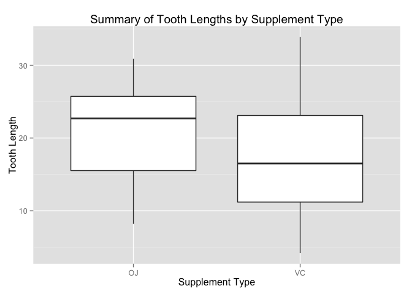

# Tooth Growth Project
Rashan Jibowu  
April 25, 2015  

### Overview

In this report, we perform some basic exploratory data analyses on the Toothgrowth dataset. We use hypothesis tests and confidence intervals to answer the following questions:

1. Do higher dose amounts yield longer tooth growth?
2. Is orange juice more effective at growing teeth than ascorbic acid?

### Set up

Load the ToothGrowth data 


```r
library(datasets)
library(ggplot2)

# load the data
data(ToothGrowth)
```

### Key Assumptions

Before summarizing and analyzing the data, let's highlight some key assumptions I am making about the data. From the description of the dataset: 

> The response is the length of odontoblasts (teeth) in each of 10 guinea pigs at each of three dose levels of Vitamin C (0.5, 1, and 2 mg) with each of two delivery methods (orange juice or ascorbic acid).

As a result, I am making the following assumptions:

1. There are 60 guinea pigs represented in the data set
2. 30 guinea pigs received vitamin C doses via orange juice and the other 30 received ascorbic acid supplements
3. Each group of 30 guinea pigs were further divided into groups of 10. Each group of 10 received a different dose of vitamin C
4. Each guinea pig is a newborn whose initial teeth length is 0. **This means the response is not only the tooth length, but also the _change_ in the tooth length.**

### Summarizing the data


```r
# basic summary
summary(ToothGrowth)
```

```
##       len        supp         dose      
##  Min.   : 4.20   OJ:30   Min.   :0.500  
##  1st Qu.:13.07   VC:30   1st Qu.:0.500  
##  Median :19.25           Median :1.000  
##  Mean   :18.81           Mean   :1.167  
##  3rd Qu.:25.27           3rd Qu.:2.000  
##  Max.   :33.90           Max.   :2.000
```

#### Distribution of Tooth Lengths


```r
g <- ggplot(aes(len), data = ToothGrowth)
g + geom_histogram(binwidth = 1) + 
    ggtitle("Distribution of Lengths") +
    xlab("Tooth Length")
```

 

#### Summaries by categorical variables

Summarize Tooth Length By Dose Amount


```r
g <- ggplot(aes(y = len, x = factor(dose)), data = ToothGrowth)
g + geom_boxplot() + 
    ggtitle("Summary of Tooth Lengths by Dose Amount") +
    xlab("Dose Amount (mg)") +
    ylab("Tooth Length")
```

 

Summarize Tooth Length By Supplement Type


```r
g <- ggplot(aes(y = len, x = factor(supp)), data = ToothGrowth)
g + geom_boxplot() + 
    ggtitle("Summary of Tooth Lengths by Supplement Type") +
    xlab("Supplement Type") +
    ylab("Tooth Length")
```

 

### Exploratory Data Analysis

Comparing tooth length by `supp` (supplement type) and `dose` (dose amount)


```r
g <- ggplot(aes(y = len, x = factor(dose)), data = ToothGrowth)
g + geom_point() + 
    facet_wrap(~ supp) + 
    ggtitle("Tooth Length By Dose Amount and Supplement Type") +
    xlab("Dose Amount (mg)") +
    ylab("Tooth Length")
```

 

### Hypothesis Testing

After exploring the data, two questions become apparent.
1. Do higher dose amounts yield longer tooth growth?
2. Is orange juice more effective at growing teeth than ascorbic acid?

#### The Effect of Dose Amounts on Tooth Length

- **Null hypothesis**: Higher dose amounts do **NOT** yield longer tooth growth
- **Alternative hypothesis**: Higher dose amounts yield longer tooth growth

Calculate mean and standard deviation of tooth length by dose amount


```r
means <- tapply(ToothGrowth$len, ToothGrowth$dose, mean)
st.devs <- tapply(ToothGrowth$len, ToothGrowth$dose, sd)
```

Since each sample has `20` guinea pigs (10 for each supplement type), we can calculate the standard error of these means.


```r
# each sample has 20 guinea pigs
st.errs <- st.devs / sqrt(20) 
```

Calculate the 95% confidence interval of the means


```r
df <- data.frame(doseAmount = unique(ToothGrowth$dose),
           meanLength = as.numeric(means), 
           sdLength = as.numeric(st.devs),
           seMean = as.numeric(st.errs))

for(i in 1:nrow(df)) {
    print(df[i,c("meanLength")] + c(-1, 1) * 1.96 * df[i,c("seMean")])
}
```

```
## [1]  8.632892 12.577108
## [1] 17.79985 21.67015
## [1] 24.44591 27.75409
```

##### Conclusion

From the above analysis. There is no overlap between any of the confidence intervals and any other confidence interval. As a result, we can reject the null hypothesis and state with 95% confidence that higher dose amount do yield longer tooth growth. 

#### The Effect of Supplement Type on Tooth Length

- **Null hypothesis**: Mean tooth growth for orange juice supplements is about the same as mean toothe growth for ascorbic acid supplements
- **Alternative hypothesis**: Mean tooth growth for orange juice supplements is **greater** than mean tooth growth for ascordbing acid supplements


```r
orange.juice <- ToothGrowth[ToothGrowth$supp == "OJ",]
ascorbic.acid <- ToothGrowth[ToothGrowth$supp == "VC",]

# Two-sided test first
t.test(orange.juice$len, ascorbic.acid$len)
```

```
## 
## 	Welch Two Sample t-test
## 
## data:  orange.juice$len and ascorbic.acid$len
## t = 1.9153, df = 55.309, p-value = 0.06063
## alternative hypothesis: true difference in means is not equal to 0
## 95 percent confidence interval:
##  -0.1710156  7.5710156
## sample estimates:
## mean of x mean of y 
##  20.66333  16.96333
```

##### Conclusion

We cannot reject the null hypothesis because the the confidence interval for this hypothesis includes 0. That means, there may be no difference in the mean tooth growth for guinea pigs taking the orange juice supplements from the mean tooth growth for guinea pigs taking the ascorbic acid supplement.
